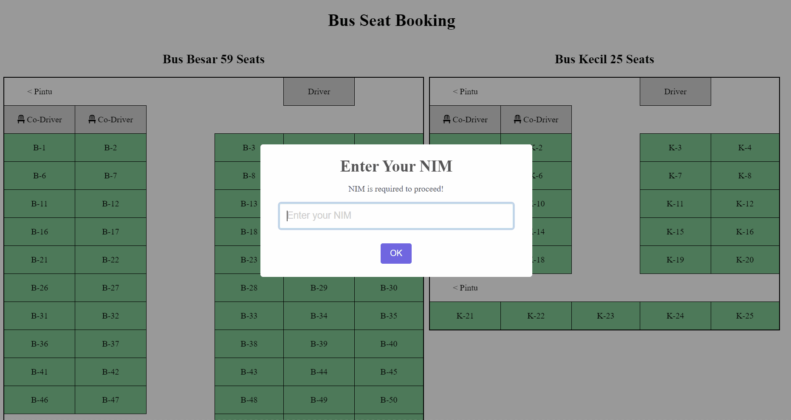

# SeatBooking

A simple and interactive Bus Seat Booking Web App powered by Google Apps Script and Google Sheets. This application allows users to book and manage seats on buses, providing a seamless experience for both admins and users.

---

## Features

### General Features
- **Interactive Seat Layout**: Displays the bus layout dynamically with different seat states:
  - **Available**: Seats that can be booked.
  - **Booked**: Seats that are already booked.
  - **Reserved**: Seats reserved for drivers or co-drivers.
- **Two Bus Configurations**:
  - Large Bus: 59 seats.
  - Small Bus: 25 seats.
- **Responsive Design**: Adjusted for different screen sizes.

### User Features
- **NIM Authentication**: Users are required to enter their NIM (unique identifier) to start booking.
- **Seat Selection**:
  - Users can click on available seats to book.
  - Prevents double booking of seats.
- **Real-Time Feedback**: Provides immediate feedback on booking status (success or failure) using SweetAlert2.
- **Booking Modification**: Users can change their current booking to another available seat.

### Admin Features
- **Google Sheets Integration**: All booking data is stored and managed via Google Sheets for easy access and updates.
- **Dynamic Seat Rendering**: Automatically updates the seat layout based on Google Sheets data.

---

## Technologies Used
- **Frontend**: 
  - HTML
  - CSS
  - JavaScript
  - Font Awesome for icons
- **Backend**:
  - Google Apps Script for handling seat booking and data synchronization with Google Sheets.
- **Libraries**:
  - [SweetAlert2](https://sweetalert2.github.io/) for beautiful and customizable alerts.

---

## How It Works
1. **Initialize**: Users must enter their NIM to access the booking system.
2. **Select a Seat**:
   - Click on an available seat to book.
   - Enter the required contact information.
   - Confirm the booking.
3. **Modify Booking**:
   - Change an existing booking by selecting a new seat and confirming the change.
4. **Admin Management**:
   - All booking data is stored in a connected Google Sheet, allowing admins to monitor and update seat statuses.

---

## How to Run the Project
1. Make a copy of this sheet: [Google Sheet](https://docs.google.com/spreadsheets/d/18CzBXLH3ksHe7mfu7dp8VKDyAvWd_TNqZ46l87inKlo/edit?usp=sharing)
1. Deploy the Google Apps Script backend:
    - Open the copied Google Sheet.
    - Navigate to Extensions > Apps Script.
    - Copy-paste the backend code and deploy it as a web app.
2. Update the frontend with your Google Apps Script code editor.
3. Deploy as web app and access through the url given.

